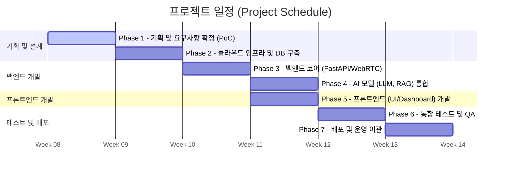

# 프로젝트 헌장 (Project Charter)

## 1. 프로젝트 개요 (Overview)
- **프로젝트 명**: 파이썬 기반 웹 AI 모의면접 플랫폼 구축
- **프로젝트 비전**: 생성형 AI(Generative AI), 컴퓨터 비전, 음성 분석 기술을 융합하여 실제 면접관을 대체/보조할 수 있는 고도화된 AI 에이전트를 개발합니다. 파이썬 생태계(FastAPI, LangChain)와 WebRTC 기술을 통합하여 실시간성과 확장성을 확보하는 것을 목표로 합니다.

## 2. 배경 및 목적 (Background & Purpose)
### 2.1 배경 (Background)
- **채용 병목 현상**: 기존 인간 주도 면접은 일정 조율의 어려움, 주관적 편향, 높은 운영 비용으로 인해 기업 경쟁력을 저하시킵니다.
- **필요성**: 시간/장소 제약 없는 객관적 피드백 도구와 대규모 동시 접속 처리가 가능한 시스템이 필요합니다.

### 2.2 프로젝트 목표 (Objectives)
- **실시간성 확보**: 음성 인식부터 AI 응답, 합성까지 End-to-End Latency를 **800ms ~ 1.5s** 이내로 단축하여 자연스러운 대화 흐름 구현.
- **평가의 객관화**: 기업/직무별 맞춤형 **채용 루브릭(Rubric)**을 시스템에 통합하여 AI가 일관성 있는 점수 산출.
- **기술적 검증**: **웹 IDE** 및 **화이트보드**를 통합하여 코딩 및 시스템 설계 면접의 실효성 확보.

## 3. 범위 (Scope)
### 3.1 In-Scope (수행 범위)
- **AI 면접관**: 적응형 질문 생성(LLM), 멀티모달(음성/표정) 분석, 실시간 개입 기능.
- **기술 면접 도구**: 라이브 코딩 환경(Python/JS 지원), 시스템 설계용 화이트보드 캔버스.
- **결과 분석**: STAR 기법 기반 답변 분석, 발화/비언어 태도 분석, 합격/불합격 추천 리포트.
- **관리자 기능**: 면접 질문지 커스터마이징, 대시보드 및 통계 시각화.

### 3.2 Out-of-Scope (제외 범위)
- (초기 단계에서는 오프라인 면접 연동이나 타사 HR 시스템과의 깊은 API 통합 등은 제외될 수 있음 - *추후 협의*)

## 4. 주요 이해관계자 (Stakeholders)
- **채용 담당자 (Recruiter)**: 대시보드를 통해 리포트를 열람하고 면접을 설계하는 관리자.
- **지원자 (Candidate)**: 웹 브라우저(무설치)로 면접에 응시하고 피드백을 받는 최종 사용자.
- **운영/개발팀**: AI 모델 성능 모니터링 및 인프라 유지보수 담당.

## 5. 주요 산출물 (Key Deliverables)
1.  **소프트웨어**: AI 면접 웹 애플리케이션 (Frontend/Backend), Docker 컨테이너 이미지.
2.  **문서**:
    - 요구사항 명세서 (SRS)
    - 시스템 아키텍처 설계서 (SAD)
    - API 명세서 및 DB 스키마 (ERD)
    - AI 모델 검증 보고서 및 테스트 결과서
    - 사용자/운영자 매뉴얼

## 6. 마일스톤 (Milestones)

