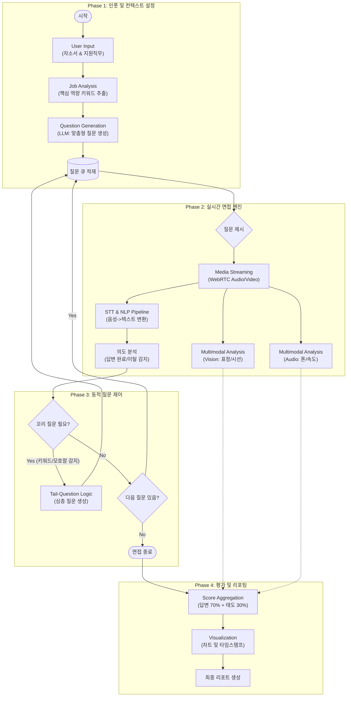

# AI 기반 모의 면접 시스템: 상세 Workflow

### 1. 단계별 데이터 흐름 설명

#### **Phase 1: 인풋 및 컨텍스트 설정 (Pre-Processing)**

- **User Input:** 사용자로부터 **자기소개서(PDF/Text)**와 **지원 직무** 정보를 받습니다.
- **Job Analysis:** 시스템은 내부 DB의 직무별 핵심 역량 키워드를 추출하여 LLM에게 전달합니다.
- **Question Generation:** LLM은 자소서 기반 맞춤형 질문 5~10개를 생성하여 큐(Queue)에 적재합니다.

#### **Phase 2: 실시간 면접 엔진 (Interaction Layer)**

- **Media Streaming:** 브라우저(WebRTC 등)를 통해 사용자의 음성과 영상 데이터를 스트리밍합니다.
- **STT & NLP Pipeline:**
  - 음성을 텍스트로 즉시 변환합니다.
  - **의도 분석(Intent Analysis):** 사용자가 답변을 마쳤는지, 혹은 질문과 동떨어진 말을 하는지 실시간 모니터링합니다.
- **Multimodal Analysis:**
  - **Vision:** OpenCV/TensorFlow 등을 활용해 눈맞춤(Eye Tracking), 표정(Emotion)을 수치화합니다.
  - **Audio:** 음성의 고저(Pitch)와 속도(WPM)를 분석합니다.

#### **Phase 3: 동적 질문 제어 (Follow-up Logic)**

- **Tail-Question Logic:** 사용자의 답변 텍스트에서 '기술적 키워드'나 '모호한 표현'을 감지하면, 고정된 질문 대신 **꼬리 질문(Deep Dive)**을 동적으로 생성하여 던집니다. (이 부분이 프로젝트의 차별화 포인트가 됩니다.)

#### **Phase 4: 평가 및 리포팅 (Post-Processing)**

- **Score Aggregation:** 답변 내용(70%) + 태도 점수(30%)를 합산합니다.
- **Visualization:** 분석된 데이터를 차트(Radial Chart 등)로 시각화하고, 다시 보기 영상에 피드백 타임스탬프를 찍어 최종 리포트를 생성합니다.

## Diagram

## Draw.io에서 사용하기

1. Draw.io (diagrams.net) 접속
2. 상단 메뉴의 **Arrange** > **Insert** > **Advanced** > **Mermaid** 클릭
3. 위의 Mermaid 코드 블록 내용을 복사해서 붙여넣기
4. **Insert** 버튼 클릭
