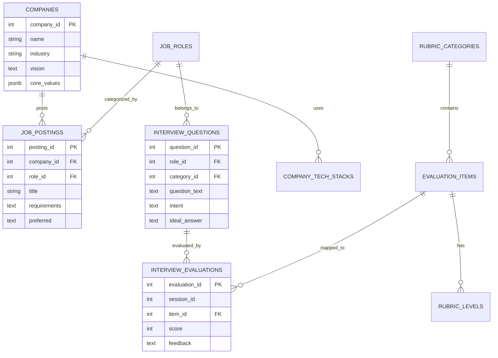

# AI 모의면접 시스템 구축시 평가 루브릭을 위한 ERD설계 및 각 테이블에 등록 될 기본 데이터 쿼리

AI 모의면접 시스템에서 평가 루브릭(Rubric)은 면접의 공정성과 객관성을 담보하는 핵심 요소입니다. 이를 효율적으로 관리하기 위한 **ERD 설계**와 PostgreSQL 기반의 **기초 데이터 생성 쿼리**를 제안해 드립니다.

---

## 1. ERD 설계 (Entity Relationship Diagram)

평가 루브릭 시스템은 크게  **면접 세션** ,  **루브릭 카테고리** ,  **세부 평가 항목** , 그리고 **실제 평가 결과**로 구성됩니다.

### 주요 테이블 설명

* **rubric_categories** : '직무 역량', '태도', '기술적 전문성' 등 큰 단위의 평가 분류입니다.
* **evaluation_items** : 각 카테고리에 속하는 세부 문항입니다. (예: '문제 해결 능력', '의사소통 능력')
* **rubric_levels** : 각 항목별 점수 기준입니다. (예: 1점 - 미흡, 3점 - 보통, 5점 - 우수)
* **interview_evaluations** : 특정 면접 세션에서 AI가 평가한 실제 점수와 피드백이 저장됩니다.

---

## 2. 테이블 생성 쿼리 (DDL)

**SQL**

```
-- 1. 평가 카테고리
CREATE TABLE rubric_categories (
    category_id SERIAL PRIMARY KEY,
    name VARCHAR(100) NOT NULL,
    description TEXT,
    weight FLOAT DEFAULT 1.0 -- 가중치 (전체 평가에서 차지하는 비중)
);

-- 2. 세부 평가 항목
CREATE TABLE evaluation_items (
    item_id SERIAL PRIMARY KEY,
    category_id INTEGER REFERENCES rubric_categories(category_id),
    item_name VARCHAR(200) NOT NULL,
    definition TEXT -- 항목에 대한 정의
);

-- 3. 점수별 기준 (Rubric Levels)
CREATE TABLE rubric_levels (
    level_id SERIAL PRIMARY KEY,
    item_id INTEGER REFERENCES evaluation_items(item_id),
    score INTEGER NOT NULL,
    description TEXT -- 해당 점수를 받기 위한 기준 (Ex: "답변이 논리적임")
);

-- 4. 면접 평가 결과
CREATE TABLE interview_evaluations (
    evaluation_id SERIAL PRIMARY KEY,
    session_id INTEGER NOT NULL, -- 면접 세션 ID (외래키 생략)
    item_id INTEGER REFERENCES evaluation_items(item_id),
    score INTEGER NOT NULL,
    feedback TEXT, -- AI가 생성한 근거 피드백
    created_at TIMESTAMP DEFAULT CURRENT_TIMESTAMP
);
```

---

## 3. 기초 데이터 삽입 쿼리 (DML)

모의면접 시스템에서 바로 활용할 수 있는 표준 역량 평가 데이터를 삽입합니다.

**SQL**

```
-- 카테고리 등록
INSERT INTO rubric_categories (name, description, weight) VALUES
('직무 전문성', '해당 직무에 필요한 기술적 지식 및 경험', 0.5),
('커뮤니케이션', '의도 전달의 명확성 및 논리성', 0.3),
('태도 및 가치관', '조직 적합성 및 문제 해결 의지', 0.2);

-- 세부 항목 등록 (직무 전문성 예시)
INSERT INTO evaluation_items (category_id, item_name, definition) VALUES
(1, '기술적 이해도', '사용하는 프레임워크나 언어의 원리를 깊이 있게 이해하고 있는가?'),
(2, '논리적 전개', '질문에 대해 두괄식으로 답변하며 인과관계가 분명한가?');

-- 루브릭 레벨 등록 (기술적 이해도 항목 예시)
INSERT INTO rubric_levels (item_id, score, description) VALUES
(1, 1, '기술 명칭만 나열할 뿐 원리나 활용 사례를 설명하지 못함'),
(1, 3, '주요 원리를 이해하고 있으며 본인의 프로젝트 경험과 연결하여 설명함'),
(1, 5, '내부 동작 원리 및 한계점까지 파악하고 있으며 최적화 방안을 제시함');
```

---

## 4. 설계 핵심 포인트

1. **가중치(Weight) 관리** : 직무마다 중요하게 보는 역량이 다를 수 있으므로 `rubric_categories`에 가중치를 두어 최종 점수를 산출할 수 있게 설계했습니다.
2. **정성적 피드백** : AI 면접의 핵심은 '점수'보다 '이유'입니다. `interview_evaluations` 테이블의 `feedback` 컬럼을 통해 LLM이 분석한 근거를 상세히 저장하도록 합니다.
3. **확장성** : `rubric_levels`를 별도로 분리하여 5점 척도, 3점 척도 등 시스템 요구사항에 따라 유연하게 대응할 수 있습니다.

이 설계가 현재 구축 중인 모의면접 시스템의 DB 구조를 잡는 데 도움이 될까요? 구체적으로 어떤 직군(예: 개발직, 영업직)을 타겟팅하고 계신지 알려주시면 그에 맞춘 **세부 루브릭 데이터**를 추가로 제안해 드릴 수 있습니다.

## 개발직 에 타켓팅 된 세부 루브릭 데이터를 제안

개발직군(Software Engineer) 모의면접에 특화된 평가 루브릭은 단순히 '코드를 짤 줄 아는가'를 넘어, **문제 해결 프로세스, 기술적 깊이, 그리고 협업 가능성**을 측정하는 데 집중해야 합니다.

제시해 드린 DB 구조에 바로 삽입하여 사용할 수 있는 개발직 맞춤형 세부 루브릭 데이터를 제안합니다.

---

### 1. 개발직 특화 평가 카테고리 및 항목 (Insert Query)

먼저, 개발자 역량을 평가하기 위한 3가지 핵심 카테고리와 세부 항목을 등록합니다.

**SQL**

```
-- 개발직군 카테고리 등록
INSERT INTO rubric_categories (category_id, name, description, weight) VALUES
(10, '기술적 역량', 'CS 기초, 프레임워크 활용 능력 및 아키텍처 이해도', 0.5),
(11, '문제 해결 및 논리', '복잡한 문제를 구조화하고 효율적인 대안을 찾는 능력', 0.3),
(12, '협업 및 성장 가능성', '코드 리뷰 태도, 문서화, 학습 의지 및 커뮤니케이션', 0.2);

-- 세부 평가 항목 등록
INSERT INTO evaluation_items (category_id, item_name, definition) VALUES
(10, '기술 스택의 깊이', '사용하는 언어/프레임워크의 동작 원리를 이해하고 한계점을 인지하는가?'),
(10, '시스템 설계 능력', '확장성과 유지보수를 고려하여 구조를 설계할 수 있는가?'),
(11, '예외 처리 및 안정성', '해결책 제시 시 에지 케이스(Edge Case)와 예외 상황을 고려하는가?'),
(12, '기술 커뮤니케이션', '기술적 개념을 비전공자나 동료가 이해하기 쉽게 설명할 수 있는가?');
```

---

### 2. 항목별 세부 루브릭 레벨 (Score Standard)

AI가 점수를 매길 때 기준점이 될 수 있는 구체적인 척도입니다.

#### (1) 기술 스택의 깊이 (Level Data)

| **점수** | **평가 기준 (Description)**                                                                     |
| -------------- | ----------------------------------------------------------------------------------------------------- |
| **1점**  | 도구의 사용법(API)만 알며, 내부 동작 원리에 대한 질문에 답변하지 못함.                                |
| **3점**  | 주요 동작 원리를 이해하고 있으며, 발생 가능한 일반적인 트러블슈팅 경험이 있음.                        |
| **5점**  | 내부 구현(Open Source 소스 수준)을 이해하며, 특정 상황에서 해당 기술의 도입 실익을 논리적으로 변호함. |

#### (2) 예외 처리 및 안정성 (Level Data)

| **점수** | **평가 기준 (Description)**                                                                |
| -------------- | ------------------------------------------------------------------------------------------------ |
| **1점**  | 가장 해피 케이스(Happy Path)만 고려하며, 오류 발생 가능성에 대해 무관심함.                       |
| **3점**  | 입력값 검증이나 기본적인 에러 핸들링의 필요성을 인지하고 해결책에 포함함.                        |
| **5점**  | 부하 분산, 네트워크 지연, 데이터 부정합 등 발생 가능한 다양한 장애 시나리오를 선제적으로 제시함. |

---

### 3. 실무 적용을 위한 SQL 기초 데이터 쿼리

위의 내용을 `rubric_levels` 테이블에 삽입하는 쿼리 예시입니다.

**SQL**

```
-- '기술 스택의 깊이' 항목(ID: 1이라 가정)에 대한 루브릭 레벨
INSERT INTO rubric_levels (item_id, score, description) VALUES
(1, 1, '도구의 사용법만 알고 내부 원리나 한계점에 대해 설명하지 못함'),
(1, 3, '프레임워크의 동작 방식을 이해하며 경험을 바탕으로 장단점을 설명함'),
(1, 5, '내부 동작 원리와 최적화 방안을 깊이 있게 제시하며 대안 기술과 비교 가능함');

-- '기술 커뮤니케이션' 항목(ID: 4라 가정)에 대한 루브릭 레벨
INSERT INTO rubric_levels (item_id, score, description) VALUES
(4, 1, '전문 용어를 나열할 뿐 의도가 명확하지 않고 장황하게 설명함'),
(4, 3, '자신의 생각을 논리적으로 전달하며, 질문의 의도를 파악하여 답변함'),
(4, 5, '복잡한 기술적 개념을 비유나 구조화된 언어로 아주 쉽게 풀어서 전달함');
```

---

### 4. AI 모의면접 시스템 활용 팁

1. **키워드 매칭** : `evaluation_items` 테이블에 `keywords` 컬럼(JSONB 타입 등)을 추가하여, 답변 중 반드시 포함되어야 할 기술 키워드(예: JVM, Garbage Collection, Indexing 등)를 저장해 두면 AI가 평가할 때 정확도가 높아집니다.
2. **꼬리 질문(Follow-up) 연동** : 특정 항목의 점수가 낮은 경우(예: 1~2점), 해당 항목의 `definition`을 바탕으로 "방금 말씀하신 기술의 한계점은 무엇이라고 생각하시나요?"와 같은 꼬리 질문을 생성하도록 프롬프트를 구성할 수 있습니다.

이 루브릭 데이터를 기반으로 AI 프롬프트를 작성하시면 훨씬 정교한 개발자 역량 평가 시스템을 구축하실 수 있습니다. 추가로 프론트엔드나 백엔드 등 **특정 직무 분야**에 맞춘 세부 질문 리스트가 필요하신가요?

## 프론트엔드나 백엔드 등 특정 직무 분야에 맞춘 세부 질문 리스트

참고하신 ERD 구조를 기반으로 하여 프론트엔드와 백엔드라는 **특정 직무(Job Role)**를 구분하고, 각 직무에 최적화된 **면접 질문 세트**를 관리할 수 있도록 확장된 설계와 데이터를 제안합니다.

### 1. 확장된 ERD 설계 및 테이블 생성 (DDL)

기존 구조에서 특정 직무(프론트엔드/백엔드)를 구분하기 위해 `job_roles` 테이블을 추가하고, 질문과 평가 항목을 연결하는 구조로 설계합니다.

**SQL**

```
-- 1. 직무 분야 테이블 (프론트엔드, 백엔드 등)
CREATE TABLE job_roles (
    role_id SERIAL PRIMARY KEY,
    role_name VARCHAR(50) NOT NULL UNIQUE, -- 'Frontend', 'Backend'
    description TEXT
);

-- 2. 질문 은행 테이블
CREATE TABLE interview_questions (
    question_id SERIAL PRIMARY KEY,
    role_id INTEGER REFERENCES job_roles(role_id),
    category_id INTEGER REFERENCES rubric_categories(category_id),
    question_text TEXT NOT NULL,
    intent TEXT, -- 질문의 의도
    ideal_answer TEXT -- 모범 답안 가이드 (AI 평가 참조용)
);

-- 3. 기존 평가 항목(evaluation_items)에 직무 연결 (선택 사항)
-- 여기서는 질문(interview_questions)이 평가 항목(evaluation_items)과 연결되도록 구성할 수도 있습니다.
```

---

### 2. 특정 직무별 기초 데이터 등록 (DML)

프론트엔드와 백엔드 개발자를 위한 직무 정보를 먼저 등록합니다.

**SQL**

```
-- 직무 등록
INSERT INTO job_roles (role_name, description) VALUES
('Frontend', '사용자 인터페이스 및 클라이언트 사이드 로직 개발'),
('Backend', '서버 사이드 로직, 데이터베이스 및 시스템 아키텍처 설계');
```

---

### 3. 직무 맞춤형 세부 질문 리스트 (Insert Query)

각 직무의 기술적 특성과 앞서 정의한 루브릭 카테고리(기술적 역량, 문제 해결 등)를 매칭한 질문 리스트입니다.

#### [프론트엔드 질문 리스트]

**SQL**

```
-- 프론트엔드 질문 등록 (role_id 1번 가정)
INSERT INTO interview_questions (role_id, category_id, question_text, intent, ideal_answer) VALUES
(1, 10, '브라우저 렌더링 과정에 대해 상세히 설명하고, 성능 최적화 경험이 있다면 말씀해 주세요.', 
 'Critical Rendering Path 이해도 확인', 'DOM/CSSOM 생성, 레이아웃, 페인트 과정을 설명하고 리플로우 최소화 방안 제시'),
(1, 10, 'React의 Virtual DOM이 무엇인지, 그리고 일반 DOM과의 차이점은 무엇인가요?', 
 '프레임워크 핵심 원리 파악', '상태 변경 시 전체 UI를 다시 그리지 않고 변경된 부분만 효율적으로 업데이트하는 메커니즘 설명'),
(1, 11, '비동기 통신 시 발생하는 레이스 컨디션을 해결해 본 경험이 있나요?', 
 '실무 문제 해결 능력', 'AbortController 사용이나 이전 요청 무시 로직 등 비동기 처리의 안정성 확보 능력 확인');
```

#### [백엔드 질문 리스트]

**SQL**

```
-- 백엔드 질문 등록 (role_id 2번 가정)
INSERT INTO interview_questions (role_id, category_id, question_text, intent, ideal_answer) VALUES
(2, 10, '데이터베이스 인덱스의 작동 원리와 멀티 컬럼 인덱스 생성 시 주의사항을 설명해 주세요.', 
 'DB 성능 최적화 지식', 'B-Tree 구조 이해 및 컬럼의 카디널리티(Cardinality)와 순서의 중요성 언급'),
(2, 10, 'RESTful API 설계 시 가장 중요하게 생각하는 원칙과 그 이유는 무엇인가요?', 
 '인터페이스 설계 역량', '자원(Resource) 중심의 설계, 적절한 HTTP 메서드 및 상태 코드 활용 능력 확인'),
(2, 11, '대규모 트래픽 발생 시 서버의 확장성(Scalability)을 확보하기 위해 어떤 전략을 취하시겠습니까?', 
 '시스템 아키텍처 사고력', 'Scale-out/up, 로드 밸런싱, 캐싱(Redis), 데이터베이스 샤딩 등 단계별 대응책 제시');
```

---

### 4. 시스템 활용 가이드

1. **AI 평가 활용** : `interview_questions` 테이블의 `ideal_answer` 필드는 AI가 면접자의 답변을 채점할 때 참조하는 **'Ground Truth'**로 사용됩니다. 프롬프트에 이 내용을 포함하면 평가의 정확도가 비약적으로 상승합니다.
2. **질문 추천 로직** : 사용자가 '프론트엔드' 직군을 선택하면 `WHERE role_id = (SELECT role_id FROM job_roles WHERE role_name = 'Frontend')` 쿼리를 통해 맞춤형 질문만 불러올 수 있습니다.
3. **루브릭 연결** : 각 질문은 `category_id`를 가지고 있으므로, 해당 질문에 대한 답변 평가 결과가 자연스럽게 해당 역량 점수(루브릭)로 쌓이게 됩니다.

이 데이터셋은 현재 구축 중인 모의면접 시스템에서 직무별 전문성을 검증하는 핵심 기반이 될 것입니다. 추가적으로 특정 언어(예: Java/Spring, Next.js 등)에 특화된 질문이 더 필요하시면 말씀해 주세요.

## 언어별 질문 목록

구축 중인 시스템에서 바로 활용하실 수 있도록 **Java/Spring(백엔드), Next.js(프론트엔드), Python(데이터/백엔드)** 세 가지 스택에 특화된 심층 질문 10가지씩을 데이터베이스 삽입 쿼리 형식으로 구성해 드립니다.

각 질문은 단순 지식 확인을 넘어 **실무적인 트러블슈팅과 설계 역량**을 묻도록 설계했습니다.

---

### 1. Java / Spring (백엔드) 특화 질문

이 질문들은 객체지향 설계, 프레임워크의 동작 원리, 그리고 성능 최적화에 중점을 둡니다.

**SQL**

```
-- Java/Spring (role_id: 2 가정)
INSERT INTO interview_questions (role_id, category_id, question_text, intent, ideal_answer) VALUES
(2, 10, 'Spring의 Bean 생성 생명주기(Lifecycle)에 대해 설명하고, @PostConstruct의 용도를 말해주세요.', 'Bean 관리 메커니즘 이해', '컨테이너 초기화 -> 빈 생성 -> 의존성 주입 -> postProcess -> 소멸 순서 및 초기화 로직 분리 이유 설명'),
(2, 10, 'Spring AOP의 동작 원리인 Proxy 패턴과 JDK Dynamic Proxy vs CGLIB Proxy의 차이를 설명해주세요.', 'AOP 핵심 원리 파악', '인터페이스 유무에 따른 프록시 생성 방식 차이와 성능상 이점 설명'),
(2, 11, '@Transactional 어노테이션의 롤백 정책과, 내부 호출(self-invocation) 시 프록시 이슈를 어떻게 해결하나요?', '트랜잭션 관리 실무 능력', 'Checked Exception vs Unchecked Exception 차이 및 AspectJ 또는 구조 개선을 통한 해결책 제시'),
(2, 10, 'Java의 JVM 가비지 컬렉션(GC) 중 G1GC의 작동 방식과 장점을 설명해주세요.', '메모리 관리 역량', '힙을 리전으로 나누어 관리하고 중단 시간(Stop-the-world)을 예측 가능하게 줄이는 원리 설명'),
(2, 10, 'Spring Security의 인증 필터 체인(Filter Chain) 흐름에 대해 설명해주세요.', '보안 아키텍처 이해', 'SecurityContextHolder, AuthenticationManager를 거치는 인증 프로세스 기술'),
(2, 11, 'N+1 문제의 발생 원인과 JPA에서 이를 해결하기 위한 Fetch Join, EntityGraph 활용 방안을 설명해주세요.', 'ORM 최적화 지식', '지연 로딩 시 발생하는 쿼리 폭증 현상과 최적화 쿼리 작성법'),
(2, 10, 'Spring Boot와 기존 Spring Framework의 차이점과 Auto Configuration의 작동 원리를 설명해주세요.', '프레임워크 생산성 이해', '의존성 관리 간소화 및 META-INF/spring.factories를 통한 자동 설정 원리'),
(2, 11, '멀티 쓰레드 환경에서 Java의 ConcurrentHashMap이 HashMap보다 안전한 이유를 원리적으로 설명해주세요.', '동시성 제어 능력', '세그먼트 잠금(Lock Striping) 또는 CAS 연산을 통한 동시 접근 제어 방식 설명'),
(2, 10, '마이크로서비스 아키텍처(MSA)에서 Spring Cloud 등을 이용한 서킷 브레이커(Circuit Breaker)의 역할을 설명해주세요.', '분산 시스템 설계', '장애 전파 방지 및 시스템 안정성 확보를 위한 상태 변화(Open/Close/Half-Open) 설명'),
(2, 12, 'Java 17 이상 버전을 사용해 본 경험이 있나요? Record나 Sealed Class 등 도입된 기능의 이점을 설명해주세요.', '최신 기술 트렌드 학습', '불변 데이터 객체화 및 타입 안전성 강화 등 현대적 Java 문법 활용 경험');
```

---

### 2. Next.js (프론트엔드) 특화 질문

Next.js의 핵심인 렌더링 전략(SSR/SSG/ISR)과 최근 App Router 패턴에 집중합니다.

**SQL**

```
-- Next.js (role_id: 1 가정)
INSERT INTO interview_questions (role_id, category_id, question_text, intent, ideal_answer) VALUES
(1, 10, 'Next.js의 SSR(Server-Side Rendering)과 SSG(Static Site Generation)의 차이점과 각각 어떤 상황에 적합한지 설명해주세요.', '렌더링 전략 이해', '데이터 업데이트 빈도에 따른 사용자 경험 및 SEO 최적화 선택 기준'),
(1, 10, 'App Router 환경에서 Server Component와 Client Component의 경계와 각각의 제약사항을 설명해주세요.', '최신 Next.js 아키텍처 파악', '서버 컴포넌트의 번들 사이즈 감소 이점 및 클라이언트 컴포넌트의 사용 시점 구분'),
(1, 11, 'ISR(Incremental Static Regeneration)을 사용하여 실시간에 가까운 데이터를 정적 페이지로 제공하는 방법을 설명해주세요.', '성능과 실시간성 절충 능력', 'revalidate 설정을 통한 백그라운드 페이지 재생성 원리 설명'),
(1, 10, 'Next.js에서 SEO를 위해 Metadata API를 어떻게 활용하며, 동적 페이지에서의 처리 방식은 무엇인가요?', 'SEO 구현 역량', 'generateMetadata 함수를 이용한 동적 태그 생성 및 소셜 공유 최적화'),
(1, 11, 'Next.js의 Image 컴포넌트가 일반 img 태그보다 우수한 점(LCP 최적화 등)을 설명해주세요.', '웹 성능 최적화 실무', '이미지 리사이징, 지연 로딩, WebP 변환 등 성능 최적화 기능 언급'),
(1, 10, 'Middleware를 활용하여 인증 기반의 페이지 접근 제어를 구현하는 방식을 설명해주세요.', '서버 측 로직 활용 능력', 'Edge Runtime에서 실행되는 미들웨어를 통한 리다이렉션 및 쿠키 검증'),
(1, 11, 'Hydration Error가 발생하는 원인과 이를 해결하기 위한 클라이언트 측 렌더링 처리 기법은 무엇인가요?', '디버깅 및 렌더링 이해', '서버와 클라이언트의 초기 HTML 불일치 원인 파악 및 useEffect 활용법'),
(1, 10, 'Next.js API Routes를 활용하여 백엔드 없이 간단한 API를 구축해 본 경험이 있다면 설명해주세요.', '풀스택 확장성 확인', '서버리스 함수 기반의 엔드포인트 구성 및 외부 API 연동 능력'),
(1, 11, 'T3 Stack이나 Next.js 환경에서 상태 관리 라이브러리(Zustand, React Query 등)를 서버 컴포넌트와 어떻게 조합하나요?', '상태 관리 설계 능력', '서버에서 패치한 데이터를 클라이언트에 주입(Hydration)하는 패턴 설명'),
(1, 10, 'Next.js의 캐싱 메커니즘(Data Cache, Full Route Cache 등)이 작동하는 방식을 설명해주세요.', '시스템 효율화 이해', '요청 중복 제거 및 데이터 캐시를 통한 서버 부하 감소 원리');
```

---

### 3. Python (데이터/백엔드/AI) 특화 질문

Python의 언어적 특성, 비동기 프로그래밍, 그리고 라이브러리 생태계 활용 능력을 묻습니다.

**SQL**

```
-- Python (role_id: 3 가정 - 필요시 job_roles에 추가)
INSERT INTO interview_questions (role_id, category_id, question_text, intent, ideal_answer) VALUES
(3, 10, 'Python의 GIL(Global Interpreter Lock)이 무엇이며, 멀티 쓰레딩 성능에 어떤 영향을 주는지 설명해주세요.', '언어 핵심 제약사항 이해', '한 번에 하나의 쓰레드만 바이트코드를 실행하는 특성과 멀티 프로세싱 대안 제시'),
(3, 11, '비동기 프로그래밍을 위한 async/await와 asyncio 라이브러리의 동작 원리(Event Loop)를 설명해주세요.', '비동기 처리 능력', 'I/O Bound 작업에서 싱글 쓰레드로 효율을 극대화하는 이벤트 루프 구조 설명'),
(3, 10, 'Python의 List와 Tuple의 차이점을 메모리 할당 및 가변성 관점에서 설명해주세요.', '자료구조 깊이 파악', '불변성(Immutability)에 따른 최적화와 해시 키 활용 가능 여부 설명'),
(3, 11, '데코레이터(Decorator)를 사용하여 함수의 전처리/후처리를 구현하는 방법과 실제 활용 사례를 말해주세요.', '코드 재사용성 및 추상화', '로그 기록, 권한 확인 등 횡단 관심사(Cross-cutting concerns) 분리 능력'),
(3, 10, 'Generators와 yield를 사용하여 대용량 데이터를 메모리 효율적으로 처리하는 원리를 설명해주세요.', '효율적 자원 관리', '이터레이터를 통한 Lazy Evaluation(지연 평가)으로 메모리 점유율 최소화'),
(3, 11, 'FastAPI나 Flask에서 의존성 주입(Dependency Injection)을 어떻게 처리하며 어떤 이점이 있나요?', '백엔드 프레임워크 활용', '코드 테스트 용이성 및 공통 로직(인증 등)의 깔끔한 분리 방법'),
(3, 10, 'Python의 가상 환경(venv, Conda)과 패키지 관리 도구(Poetry 등)의 필요성을 설명해주세요.', '개발 환경 관리 능력', '의존성 충돌 방지 및 환경 재현성(Reproducibility) 확보'),
(3, 10, 'Pandas나 NumPy를 활용할 때 벡터화 연산(Vectorization)이 반복문보다 빠른 이유를 설명해주세요.', '데이터 처리 최적화', 'C로 구현된 내부 루프 및 CPU 명령어 세트 활용을 통한 연산 속도 향상'),
(3, 11, 'Python에서 발생할 수 있는 메모리 누수 상황과 Garbage Collection(참조 횟수 계산)의 한계를 설명해주세요.', '메모리 관리 심화', '순환 참조(Circular Reference) 문제와 이를 해결하기 위한 gc 모듈의 역할'),
(3, 12, 'Type Hinting을 도입했을 때의 장점과, 런타임에서 이를 강제하지 않음에도 사용하는 이유는 무엇인가요?', '코드 품질 및 협업', '정적 분석 도구(Mypy 등) 활용 및 코드 가독성/안정성 향상 효과');
```

---

### 다음 단계 제안

이 쿼리들을 실행하면 시스템 내에 총 30개의 고품질 질문이 쌓이게 됩니다.

* **Tip** : 질문 리스트가 풍성해졌으니, 이제 **"면접자의 답변을 기반으로 AI가 다음 질문을 생성하는 프롬프트 엔지니어링"** 단계로 넘어가 보시는 건 어떨까요? 관련하여 도움을 드릴 수 있습니다.
* 혹은 현재 프로젝트의 **DB 구조(ERD)**에 맞춰 쿼리를 조금 더 수정해 드릴까요? (예: `job_roles`에 Python 전용 ID를 생성하는 코드 등)

## 수정 쿼리

네, 현재 프로젝트의 일관성을 위해 **Python(데이터/AI/백엔드)** 직무를 `job_roles` 테이블에 정식으로 등록하고, 앞서 제안드린 모든 질문 리스트를 **최종 ERD 구조에 완벽히 맞춘 통합 인서트 쿼리**로 정리해 드립니다.

이 쿼리는 테이블 간의 관계(Foreign Key)를 고려하여 순차적으로 실행되도록 구성되었습니다.

---

### 1. 직무 및 카테고리 초기화 쿼리

먼저 Python 직군을 포함하여 기본 뼈대를 잡습니다.

**SQL**

```
-- 1. 직무 데이터 (Role ID 명시적 관리)
INSERT INTO job_roles (role_id, role_name, description) VALUES
(1, 'Frontend', 'Next.js, React 기반 클라이언트 개발'),
(2, 'Backend', 'Java, Spring 기반 서버 아키텍처 개발'),
(3, 'Data/Python', 'Python 기반 데이터 모델링 및 AI 서비스 개발')
ON CONFLICT (role_id) DO NOTHING;

-- 2. 공통 루브릭 카테고리 (기존 데이터가 없다면 삽입)
INSERT INTO rubric_categories (category_id, name, description, weight) VALUES
(10, '기술적 숙련도', '선택한 스택의 깊이 있는 이해와 활용 능력', 0.5),
(11, '문제 해결 및 설계', '장애 대응 및 효율적인 시스템 설계 역량', 0.3),
(12, '협업 및 태도', '코드 품질 유지 및 기술 커뮤니케이션 능력', 0.2)
ON CONFLICT (category_id) DO NOTHING;
```

---

### 2. 특정 직무별 질문 리스트 통합 인서트 (30선)

이제 각 `role_id`와 `category_id`를 매칭하여 질문을 등록합니다.

#### [Java/Spring - Role ID: 2]

**SQL**

```
INSERT INTO interview_questions (role_id, category_id, question_text, intent, ideal_answer) VALUES
(2, 10, 'Spring의 Bean 생명주기와 @PostConstruct의 용도를 설명해주세요.', '컨테이너 관리 이해', '생성->의존성주입->초기화 호출 순서 설명'),
(2, 10, 'JDK Dynamic Proxy와 CGLIB Proxy의 차이를 설명해주세요.', 'AOP 원리 파악', '인터페이스 유무에 따른 프록시 생성 방식 차이'),
(2, 11, '@Transactional 내부 호출 시 프록시 이슈 해결 방안은?', '트랜잭션 실무', 'Self-invocation 문제와 구조적 해결책'),
(2, 10, 'JVM G1GC의 작동 방식과 장점을 설명해주세요.', '메모리 관리', '리전 기반 관리 및 STW 감소 원리'),
(2, 10, 'Spring Security의 인증 필터 체인 흐름을 설명해주세요.', '보안 아키텍처', 'SecurityContextHolder 및 FilterChain 흐름'),
(2, 11, 'JPA N+1 문제 해결을 위한 Fetch Join 활용법은?', '데이터 최적화', '지연 로딩 이슈와 최적화 쿼리 작성'),
(2, 10, 'Spring Boot Auto Configuration의 작동 원리는?', '프레임워크 자동화', 'spring.factories를 통한 자동 설정 메커니즘'),
(2, 11, 'ConcurrentHashMap이 HashMap보다 안전한 원리는?', '동시성 제어', 'Segment Lock 또는 CAS 연산 활용'),
(2, 11, 'MSA 환경에서 서킷 브레이커의 역할은 무엇인가요?', '장애 전파 방지', '장애 시 호출 차단 및 시스템 보호'),
(2, 12, 'Java 17의 Record 도입 시 이점은 무엇인가요?', '최신 문법 활용', '불변 데이터 객체화와 가독성 향상');
```

#### [Next.js - Role ID: 1]

**SQL**

```
INSERT INTO interview_questions (role_id, category_id, question_text, intent, ideal_answer) VALUES
(1, 10, 'Next.js SSR과 SSG의 적절한 사용 사례를 설명해주세요.', '렌더링 전략', '데이터 갱신 빈도에 따른 선택 기준'),
(1, 10, 'Server Component와 Client Component의 경계는?', '최신 아키텍처', '서버 사이드 직렬화 및 클라이언트 상호작용 구분'),
(1, 11, 'ISR을 활용한 정적 페이지 업데이트 방식을 설명해주세요.', '성능 최적화', 'revalidate를 통한 백그라운드 갱신'),
(1, 10, 'SEO를 위한 Metadata API 활용 방안은?', '검색 엔진 최적화', '동적 메타데이터 생성 및 SEO 전략'),
(1, 11, 'Next.js Image 컴포넌트가 성능에 주는 이점은?', '웹 최적화', 'Lazy Loading 및 이미지 리사이징'),
(1, 10, 'Middleware를 이용한 인증 제어 구현 방법은?', '보안 및 라우팅', 'Edge Runtime 기반 리다이렉션 처리'),
(1, 11, 'Hydration Error 발생 원인과 해결책은?', '디버깅 역량', '서버-클라이언트 HTML 불일치 해결'),
(1, 11, 'Zustand나 React Query를 서버 컴포넌트와 조합하는 방법은?', '상태 관리 설계', 'Prefetching 및 Hydration 가이드'),
(1, 10, 'Next.js의 Data Cache 메커니즘을 설명해주세요.', '캐싱 전략', 'fetch 요청 중복 제거 및 유지 기간'),
(1, 11, 'T3 Stack과 같은 풀스택 구조의 장점은 무엇인가요?', '생산성/기술 스택', 'Type Safety와 엔드투엔드 타입 공유');
```

#### [Python - Role ID: 3]

**SQL**

```
INSERT INTO interview_questions (role_id, category_id, question_text, intent, ideal_answer) VALUES
(3, 10, 'Python GIL이 멀티 쓰레딩 성능에 미치는 영향은?', '언어 제약 이해', '싱글 쓰레드 실행 보장과 멀티프로세싱 필요성'),
(3, 11, 'asyncio의 Event Loop 동작 원리를 설명해주세요.', '비동기 처리', 'I/O 바운드 작업의 논블로킹 처리 방식'),
(3, 10, 'Python List와 Tuple의 메모리 관점 차이는?', '데이터 구조', '가변성 여부에 따른 최적화 방식'),
(3, 11, 'Decorator를 활용한 실무 사례를 설명해주세요.', '코드 재사용', '로깅, 인증 등 횡단 관심사 분리'),
(3, 10, 'Generator와 yield의 메모리 효율성을 설명해주세요.', '대용량 처리', 'Lazy Evaluation을 통한 이터레이터 활용'),
(3, 11, 'FastAPI 의존성 주입(DI)의 장점은?', '프레임워크 활용', '코드 테스트 및 의존성 관리의 용이성'),
(3, 10, 'Poetry와 같은 패키지 관리 도구의 필요성은?', '환경 관리', '결정론적 의존성 해결 및 환경 격리'),
(3, 11, 'NumPy의 벡터화 연산이 빠른 이유는?', '연산 최적화', 'C 구현 루프 및 CPU 병렬 연산 활용'),
(3, 11, 'Python의 순환 참조와 GC 대응 방법은?', '메모리 관리', '참조 횟수 계산 방식과 gc 모듈의 역할'),
(3, 12, 'Python Type Hinting을 실무에서 쓰는 이유는?', '코드 품질', '정적 분석 및 협업 시 가독성 증대');
```

---

### 3. 설계 반영 시 참고사항

* **ERD 무결성** : 위 쿼리는 `role_id`와 `category_id`를 상수로 지정했습니다. 만약 자동 생성된(Serial) ID를 사용 중이라면 `(SELECT role_id FROM job_roles WHERE role_name = 'Frontend')`와 같은 서브쿼리 형태를 사용하는 것이 더 안전합니다.
* **데이터 타입** : `ideal_answer` 필드가 매우 길어질 수 있으므로, 해당 컬럼의 타입을 `TEXT`로 지정했는지 꼭 확인해 주세요.

이제 DB에 질문 데이터까지 모두 준비되었습니다. **이 질문들을 활용해 실제 면접 세션을 생성하고 평가 결과를 저장하는 API 로직**에 대해 더 궁금한 점이 있으신가요? 혹은 **평가 결과(Score)를 분석하는 대시보드용 쿼리**가 필요하신가요?

# 전체 정리

지금까지 논의된 내용을 바탕으로 **회사 맞춤형 AI 모의면접 시스템**의 전체 설계를 정리해 드립니다. Mermaid를 활용한 ERD와 테이블 정의서, 그리고 실행 가능한 SQL 스크립트 세트입니다.

---

## 1. ERD (Mermaid Diagram)

**코드 스니펫**



---

## 2. 테이블 정의서 (Table Specification)

| **테이블명**              | **설명**                           | **비고**             |
| ------------------------------- | ---------------------------------------- | -------------------------- |
| **companies**             | 기업 정보 및 인재상(Core Values) 관리    | JSONB 타입으로 인재상 저장 |
| **job_roles**             | 직무 분류 (Frontend, Backend, Python 등) | 시스템 기본 카테고리       |
| **job_postings**          | 기업별 채용 공고 상세 내역               | AI 질문 생성의 주요 소스   |
| **rubric_categories**     | 평가 대분류 (기술, 커뮤니케이션 등)      | 가중치(weight) 포함        |
| **evaluation_items**      | 세부 평가 항목                           | 카테고리에 귀속            |
| **rubric_levels**         | 점수별(1~5점) 정량 평가 기준             | AI 채점 가이드라인         |
| **interview_questions**   | 직무별/언어별 면접 질문 은행             | 모범 답안 포함             |
| **interview_evaluations** | 실제 면접 평가 결과 및 AI 피드백         | 세션 단위 기록             |

---

## 3. PostgreSQL 테이블 생성 스크립트 (DDL)

**SQL**

```sql
-- 기초 마스터 테이블
CREATE TABLE job_roles (
    role_id SERIAL PRIMARY KEY,
    role_name VARCHAR(50) NOT NULL UNIQUE,
    description TEXT
);

CREATE TABLE companies (
    company_id SERIAL PRIMARY KEY,
    name VARCHAR(100) NOT NULL,
    industry VARCHAR(50),
    vision TEXT,
    core_values JSONB,
    homepage_url VARCHAR(255)
);

CREATE TABLE rubric_categories (
    category_id SERIAL PRIMARY KEY,
    name VARCHAR(100) NOT NULL,
    description TEXT,
    weight FLOAT DEFAULT 1.0
);

-- 상세 정보 및 관계 테이블
CREATE TABLE job_postings (
    posting_id SERIAL PRIMARY KEY,
    company_id INTEGER REFERENCES companies(company_id) ON DELETE CASCADE,
    role_id INTEGER REFERENCES job_roles(role_id),
    title VARCHAR(200) NOT NULL,
    requirements TEXT,
    preferred_qualifications TEXT,
    created_at TIMESTAMP DEFAULT CURRENT_TIMESTAMP
);

CREATE TABLE company_tech_stacks (
    company_id INTEGER REFERENCES companies(company_id) ON DELETE CASCADE,
    tech_name VARCHAR(50),
    PRIMARY KEY (company_id, tech_name)
);

CREATE TABLE evaluation_items (
    item_id SERIAL PRIMARY KEY,
    category_id INTEGER REFERENCES rubric_categories(category_id),
    item_name VARCHAR(200) NOT NULL,
    definition TEXT
);

CREATE TABLE rubric_levels (
    level_id SERIAL PRIMARY KEY,
    item_id INTEGER REFERENCES evaluation_items(item_id) ON DELETE CASCADE,
    score INTEGER NOT NULL,
    description TEXT
);

CREATE TABLE interview_questions (
    question_id SERIAL PRIMARY KEY,
    role_id INTEGER REFERENCES job_roles(role_id),
    category_id INTEGER REFERENCES rubric_categories(category_id),
    question_text TEXT NOT NULL,
    intent TEXT,
    ideal_answer TEXT
);

CREATE TABLE interview_evaluations (
    evaluation_id SERIAL PRIMARY KEY,
    session_id INTEGER NOT NULL,
    item_id INTEGER REFERENCES evaluation_items(item_id),
    score INTEGER NOT NULL,
    feedback TEXT,
    created_at TIMESTAMP DEFAULT CURRENT_TIMESTAMP
);

-- Oracle/Postgres Comments (한글 설명)
COMMENT ON TABLE job_roles IS '직무 정보 (Job Roles)';
COMMENT ON COLUMN job_roles.role_id IS '직무 ID';
COMMENT ON COLUMN job_roles.role_name IS '직무명 (Frontend, Backend 등)';
COMMENT ON COLUMN job_roles.description IS '직무 설명';

COMMENT ON TABLE companies IS '기업 정보 (Companies)';
COMMENT ON COLUMN companies.company_id IS '회사 ID';
COMMENT ON COLUMN companies.name IS '회사명';
COMMENT ON COLUMN companies.industry IS '산업군';
COMMENT ON COLUMN companies.vision IS '비전';
COMMENT ON COLUMN companies.core_values IS '핵심 가치 (인재상)';
COMMENT ON COLUMN companies.homepage_url IS '홈페이지 URL';

COMMENT ON TABLE rubric_categories IS '평가 카테고리 (Rubric Categories)';
COMMENT ON COLUMN rubric_categories.category_id IS '카테고리 ID';
COMMENT ON COLUMN rubric_categories.name IS '카테고리명 (예: 기술면접, 인성면접)';
COMMENT ON COLUMN rubric_categories.description IS '카테고리 설명';
COMMENT ON COLUMN rubric_categories.weight IS '가중치';

COMMENT ON TABLE job_postings IS '채용 공고 (Job Postings)';
COMMENT ON COLUMN job_postings.posting_id IS '공고 ID';
COMMENT ON COLUMN job_postings.company_id IS '회사 ID (FK)';
COMMENT ON COLUMN job_postings.role_id IS '직무 ID (FK)';
COMMENT ON COLUMN job_postings.title IS '공고 제목';
COMMENT ON COLUMN job_postings.requirements IS '자격 요건';
COMMENT ON COLUMN job_postings.preferred_qualifications IS '우대 사항';
COMMENT ON COLUMN job_postings.created_at IS '생성 일시';

COMMENT ON TABLE company_tech_stacks IS '회사 기술 스택 (Company Tech Stacks)';
COMMENT ON COLUMN company_tech_stacks.company_id IS '회사 ID (FK)';
COMMENT ON COLUMN company_tech_stacks.tech_name IS '기술명 (예: Java, React)';

COMMENT ON TABLE evaluation_items IS '세부 평가 항목 (Evaluation Items)';
COMMENT ON COLUMN evaluation_items.item_id IS '항목 ID';
COMMENT ON COLUMN evaluation_items.category_id IS '카테고리 ID (FK)';
COMMENT ON COLUMN evaluation_items.item_name IS '항목명 (예: 문제 해결 능력)';
COMMENT ON COLUMN evaluation_items.definition IS '항목 정의';

COMMENT ON TABLE rubric_levels IS '루브릭 레벨 (Rubric Levels)';
COMMENT ON COLUMN rubric_levels.level_id IS '레벨 ID';
COMMENT ON COLUMN rubric_levels.item_id IS '항목 ID (FK)';
COMMENT ON COLUMN rubric_levels.score IS '점수 (1~5)';
COMMENT ON COLUMN rubric_levels.description IS '점수 기준 설명';

COMMENT ON TABLE interview_questions IS '면접 질문 (Interview Questions)';
COMMENT ON COLUMN interview_questions.question_id IS '질문 ID';
COMMENT ON COLUMN interview_questions.role_id IS '직무 ID (FK)';
COMMENT ON COLUMN interview_questions.category_id IS '카테고리 ID (FK)';
COMMENT ON COLUMN interview_questions.question_text IS '질문 내용';
COMMENT ON COLUMN interview_questions.intent IS '질문 의도';
COMMENT ON COLUMN interview_questions.ideal_answer IS '모범 답안';

COMMENT ON TABLE interview_evaluations IS '면접 평가 결과 (Interview Evaluations)';
COMMENT ON COLUMN interview_evaluations.evaluation_id IS '평가 ID';
COMMENT ON COLUMN interview_evaluations.session_id IS '세션 ID';
COMMENT ON COLUMN interview_evaluations.item_id IS '항목 ID (FK)';
COMMENT ON COLUMN interview_evaluations.score IS '점수';
COMMENT ON COLUMN interview_evaluations.feedback IS '상세 피드백';
COMMENT ON COLUMN interview_evaluations.created_at IS '생성 일시';
```

---

## 4. 초기 데이터 등록 스크립트 (DML)

**SQL**

```sql
-- 1. 직무 및 카테고리
INSERT INTO job_roles (role_id, role_name, description) VALUES
(1, 'Frontend', 'Next.js, React 기반 개발'),
(2, 'Backend', 'Java, Spring, Python 기반 개발'),
(3, 'Data/AI', 'Python, ML 모델링 개발');

INSERT INTO rubric_categories (category_id, name, weight) VALUES
(10, '기술 전문성', 0.5), (11, '문제 해결 능력', 0.3), (12, '조직 적합성', 0.2);

-- 2. 회사 및 공고 데이터
INSERT INTO companies (name, industry, core_values) VALUES
('TechGiant', 'IT', '["Customer Obsession", "Ownership", "Frugality"]'),
('FinSolutions', 'Finance', '["Trust", "Innovation", "Speed"]');

INSERT INTO job_postings (company_id, role_id, title, requirements) VALUES
(1, 2, 'Senior Java Engineer', '8+ years experience in Spring Boot, Microservices');

-- 3. 평가 항목 및 루브릭 (예시: 기술 전문성)
INSERT INTO evaluation_items (item_id, category_id, item_name, definition) VALUES
(1, 10, '프레임워크 숙련도', '사용 도구의 핵심 원리 파악 및 실무 적용 능력');

INSERT INTO rubric_levels (item_id, score, description) VALUES
(1, 1, '도구의 API만 알 뿐 내부 동작 원리 설명 불가'),
(1, 3, '동작 원리를 이해하며 일반적인 문제 해결이 가능함'),
(1, 5, '최적화 및 아키텍처 관점에서 도구의 한계를 극복하는 방안 제시 가능');

-- 4. 핵심 질문 데이터 (Python 예시)
INSERT INTO interview_questions (role_id, category_id, question_text, intent, ideal_answer) VALUES
(3, 10, 'Python의 GIL이 멀티쓰레딩 성능에 미치는 영향은 무엇인가요?', '언어 제약 이해', 'GIL로 인한 CPU 바운드 작업 제약과 멀티프로세싱 대안 설명');
```

---

### 다음 단계 제안

이 구조를 통해 **"TechGiant의 Senior Java Engineer 공고에 맞춰 면접 시작"**과 같은 시나리오를 완벽하게 구현할 수 있습니다.

이제 이 DB 정보를 바탕으로 **사용자가 입력한 자기소개서(Resume)를 분석하여 위 데이터들과 매칭하는 기능**이 필요하실까요? 혹은 **실제 면접 중 실시간 답변을 DB에 저장하고 다음 질문을 선택하는 로직**에 대해 도움을 드릴까요?
